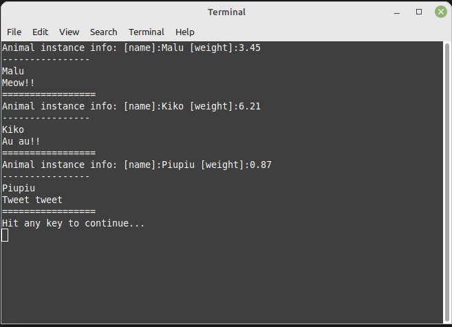

# zoo-project-cpp

## Goals

Use/pratice:
- Inheritance
- Polymorphism

## Methods

The architecture of the project is as follows:


One of the goals is to practice inheritance and polymorphism. So it is used the functions

```c++
void printAnimalName(const Zoo::Animal& animal)
{
}

void animalSound(const Zoo::Animal& animal)
{
}
```

Where are used those concepts.

Another thing that this project has is a vector with pointers to the base class. 

```c++
std::vector<Zoo::Animal*> animals;
```

This is necessary because the Animal class is abstract. So we cannot instantiate it. Thus we need to use a pointer to the object. [Know more](https://stackoverflow.com/questions/2160920/why-cant-we-declare-a-stdvectorabstractclass)

## Results


